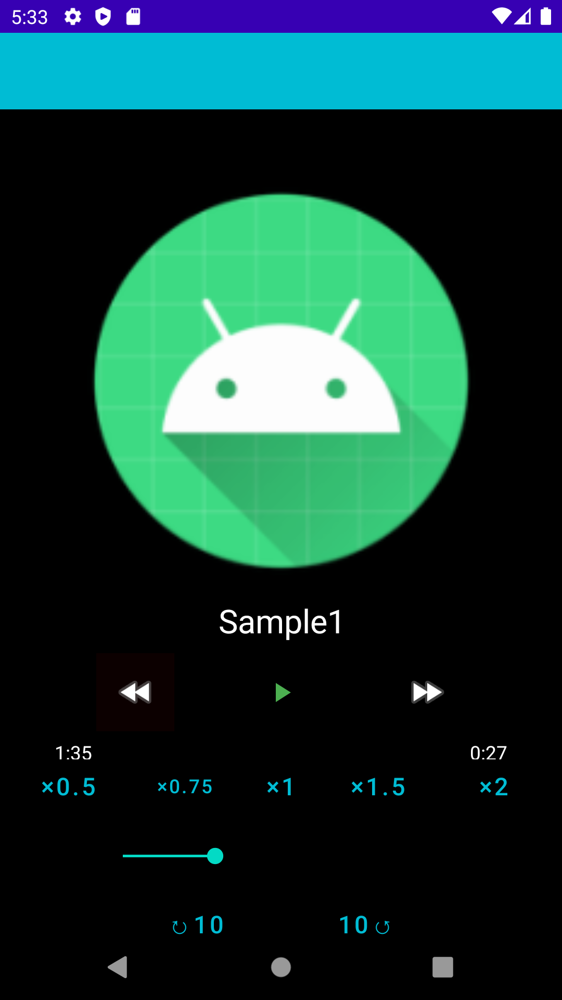
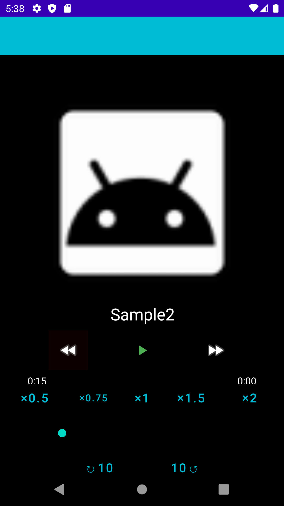
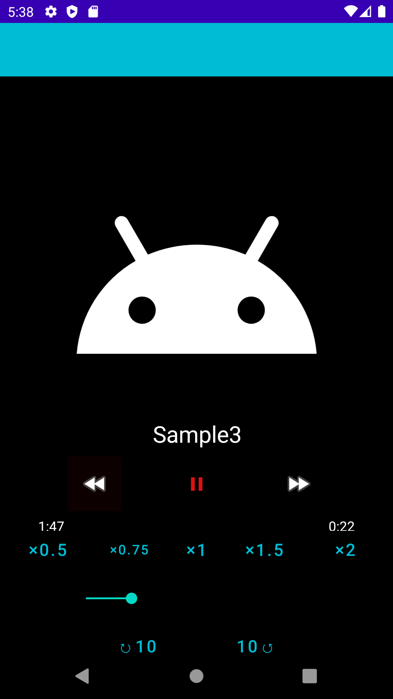

　    

# :pencil: Canvas  

## Demo
[Here](https://drive.google.com/file/d/1kA0BCeKgMvYR4jIPhoMPGwYIFZ7SE8dj/view?usp=sharing) is a demonstration video.

## My other portfolio is here .
- :pencil:[Canvas](https://github.com/TatsuyaHasunuma0123/Canvas)
- 📆[Twitter Calender](https://github.com/TatsuyaHasunuma0123/Calendar)
- 🕸️[Discussion Web](https://github.com/TatsuyaHasunuma0123/Discuss)
  
## Usage
- Install the latest version from the [official AndroidStudio app](https://developer.android.com/studio). 
- **clone** this repositories and open project with AndroidStudio.  
**:collision: werning**: There is a possibility that it may not work depending on your environment.
```
git clone https://github.com/TatsuyaHasunuma0123/canvas
```
